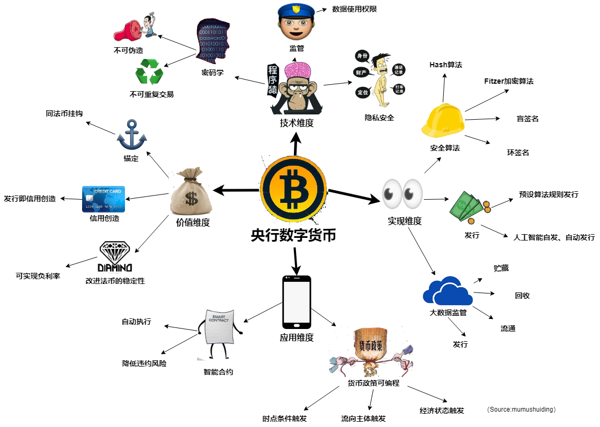

# 央行数字货币的四个维度

央行数字货币主要属于 ***现金（M0)*** 范畴。它是一个基于银行 ***账户*** 和数字货币 ***钱包*** 分层并用的架构，以使法定数字货币可以有机融入 “中央银行-商业银行” ***二元*** 体系，***复用*** 现有的成熟的金融基础设施。

法定数字货币的四个 ***维度***：
  * ***价值*** 维度
  * ***技术*** 维度
  * ***实现*** 维度
  * ***应用*** 维度

## 价值维度

法定货币本质是 ***信用*** 货币，它是中央银行对公众发行的 ***债务***，以 ***国家信用*** 为价值支撑，它具有优势：
  * 有价值 ***锚定***，价值稳定，能够有效发挥货币功能。
  * 有 ***信用创造*** 功能，从而对经济有实质作用。它本身就是信用，是发行主体信用的证券化，货币的创造过程即是信用创造过程。
  * 有助于 ***改进*** 法币的价值稳定。央行的货币政策有 ***通胀*** 的倾向，在数字货币环境下，有效 ***负利率*** 政策将成为可能，央行可能不再需要设定目标通货膨胀率缓冲，理论上中央银行的目标通货膨胀率可降至0.

## 技术维度

数字货币本质是 ***加密*** 货币，加密技术是法定数字货币实现技术安全和可信的关键要素。
具体而言：
  * ***设计*** 上：需要运用 ***密码学*** 理论保障货币的不可 ***伪造*** 、不可 ***重复交易*** 等特性;
  * ***用户体验*** 上：通过 ***隐私*** 保护技术确保用户数据的 ***安全*** 。
  * ***监管*** 上：通过 ***安全*** 和 ***隐私*** 保护技术来管理相关数据使用权限。

## 实现维度

法定数字货币是 ***算法*** 货币，包含3层意思：
  * ***设计*** 上：采用各种加密算法来保障安全可信，如 Hash算法、Fitzer加密算法、盲签名、环签名等。
  * 货币 ***发行*** 环节：
    * 使用预设可靠的 ***算法*** 规则来进行发行。
    * 基于 ***人工智能*** 模型，自动发行。
  * ***监管*** 上：可以运用 ***大数据*** 算法对货币 ***运营*** 规律进行深度分析，为货币政策宏观审慎监管和金融稳定分析等干预需求提供数据支撑。

  预计未来，在法定数字货币环境下，通过预设、可靠的程序 ***算法*** 规则，由经济系统 ***自发*** 、内生地决策货币供应量， ***自动*** 地发行和回收货币。

## 应用维度

法定数字货币是 ***智能*** 货币：
  * ***用户体验*** ：***智能合约*** 执行自动且可信，可以在技术上提供降低 ***合同违约*** 和 ***信用违约*** 风险的新手段。
  * ***货币政策*** ：法定数字货币的 ***可追踪性*** 和 ***可编程性*** 将会让政策执行变得更加智能，比如：
    * ***时点*** 条件触发 （time contingent）：让货币只有在商业银行 ***放贷*** 时才能生效，避免货币 ***空转***
    * 流向 ***主体*** 条件触发（sector contingent）：限定商业银行贷款 ***流向***，精准定向货币投放，提高金融服务实体经济能力
    * 信贷利率条件触发（loan rate contingent）：让商业银行信贷利率满足关于 ***基准利率*** 的函数，从而实现基准利率向贷款利率的有效实时传导。
    * ***经济状态*** 条件触发（economic state congingent）:根据宏观经济状态，***逆周期*** 调整商业银行对中央银行的资金归还利率，从而减少商业银行风险特征及其贷款行为的顺周期性，实现经济的逆周期调控。

