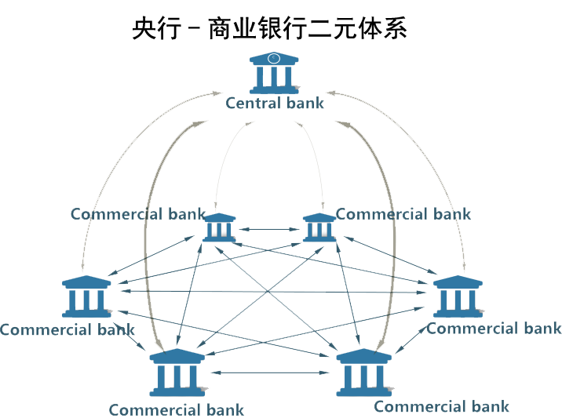
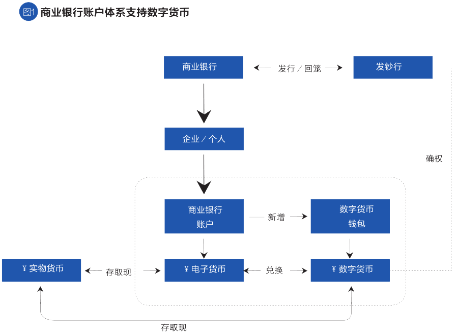
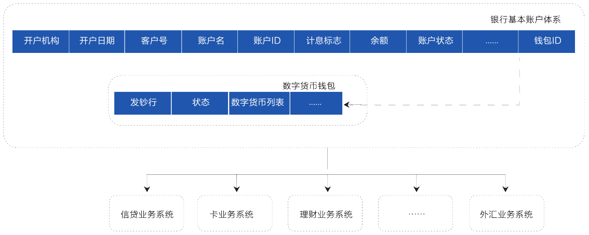
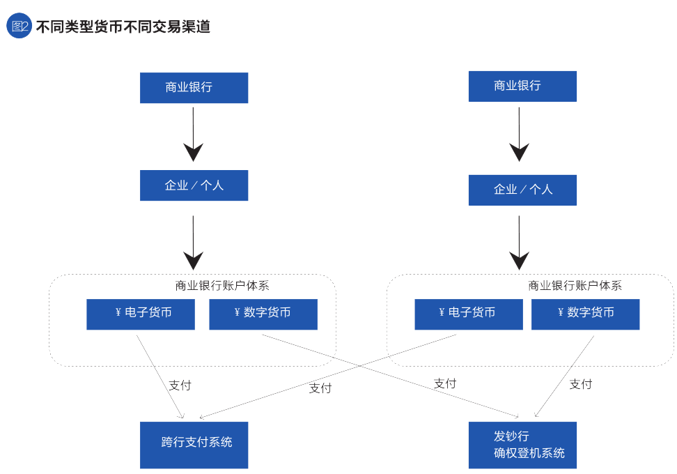

# 数字货币与银行账户

## :chicken:基于账户和不基于账户

虽然纯数字货币系统可以不与银行账户关联，但是我国的货币发行遵循 ***中央*** 银行到 ***商业*** 银行的 ***二元*** 体系，如果能 ***复用*** 现有的 ***IT基础设施***以及 ***应用和服务体系***，有助于最广大的客户群体使用数字货币。事实上，商业银行和一些其他金融机构以央行存款形式持有的中央银行求偿权已经数字化。但是，若是允许让包括 ***居民*** 在内的非金融部门直接持有 ***央行账户***，那会引发存款从商业银行 ***转移*** 到央行，导致整个银行体系缩窄，成为“狭义银行”。

## 账户体系和交易

为了 ***缓冲*** 独立数字货币体系给现有银行体系带来的冲击，在具体设计上，可考虑在商业银行传统账户体系上，新增数字货币 ***钱包*** ，实现一个账户下既可以管理现有 ***电子货币*** ，也可以管理 ***数字货币***。

数字货币属于 ***M0*** 范畴，是发钞行的 ***负债***，客户之间 ***点对点*** 交易数字货币，由央行数字货币发行系统进行交易 ***确认*** 与管理。交易电子货币，则和现有流程一致，通过央行跨行支付系统、商业银行核心业务系统完成。

## 结论

通过在商业银行账户体系中新增数字货币属性的方法，法定数字货币不仅可以有机 ***融入*** “中央银行-商业银行”二元体系，***复用*** 现有的成熟的金融基础设备，更重要的是，经此处理，既可使之独立开来，又可分层并用，发钞行只需对数字货币 ***负责*** ，账户行承担实际的 ***业务*** ，应用开发商落实具体的实现，各司其职，边界清晰。